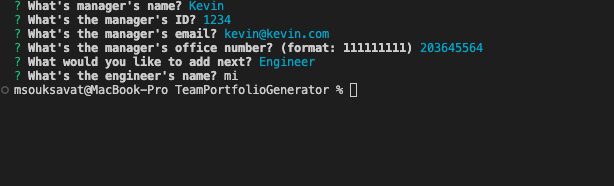

# TeamPortfolioGenerator

### Github : https://github.com/kevinl206/TeamPortfolioGenerator.git

### Walkthrough video : https://drive.google.com/file/d/1gVhwAwNl0dS05WuIyIpxj2A4ypYm9Hf-/view

## Description
A Node.js command-line application that takes in information about managers, engineers, and interns on a software engineering team and generates an HTML webpage that displays summaries for each person.


## User Story
```
- AS A manager
- I WANT to generate a webpage that displays my team's basic info
- SO THAT I have quick access to their emails and GitHub profiles
```


## Functionality





## Technologies Used
<p><a href="https://nodejs.org/">Node.js</a></p>
<p><a href="https://www.npmjs.com/">NPM</a></p>
<p><a href="https://www.npmjs.com/package/jest">Jest</a></p>
<p><a href="https://www.npmjs.com/package/inquirer">Inquirer.js</a></p>


## Contributor:
<u>Kevin Lang</u>
<br>
- Github: (https://github.com/kevinl206)
